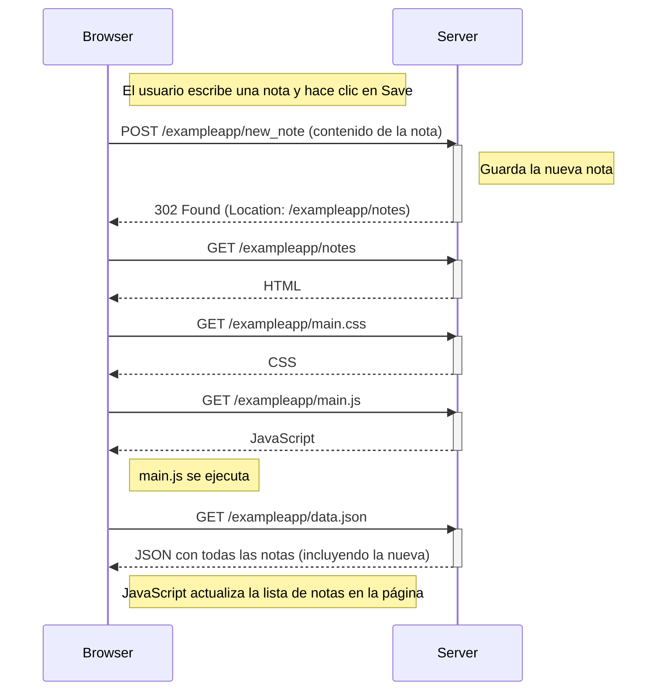

```mermaid
sequenceDiagram
    participant Browser
    participant Server

    Note right of Browser: El usuario escribe una nota y hace clic en Save

    Browser->>Server: POST /exampleapp/new_note (contenido de la nota)
    activate Server
    Note right of Server: Guarda la nueva nota
    Server-->>Browser: 302 Found (Location: /exampleapp/notes)
    deactivate Server

    Browser->>Server: GET /exampleapp/notes
    activate Server
    Server-->>Browser: HTML
    deactivate Server

    Browser->>Server: GET /exampleapp/main.css
    activate Server
    Server-->>Browser: CSS
    deactivate Server

    Browser->>Server: GET /exampleapp/main.js
    activate Server
    Server-->>Browser: JavaScript
    deactivate Server

    Note right of Browser: main.js se ejecuta

    Browser->>Server: GET /exampleapp/data.json
    activate Server
    Server-->>Browser: JSON con todas las notas (incluyendo la nueva)
    deactivate Server

    Note right of Browser: JavaScript actualiza la lista de notas en la página
```
