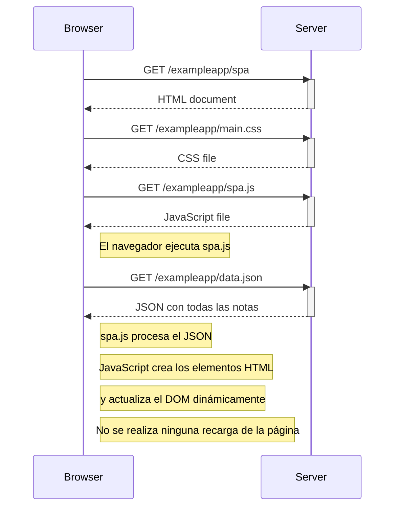

```mermaid
sequenceDiagram
    participant Browser
    participant Server

    Browser->>Server: GET /exampleapp/spa
    activate Server
    Server-->>Browser: HTML document
    deactivate Server

    Browser->>Server: GET /exampleapp/main.css
    activate Server
    Server-->>Browser: CSS file
    deactivate Server

    Browser->>Server: GET /exampleapp/spa.js
    activate Server
    Server-->>Browser: JavaScript file
    deactivate Server

    Note right of Browser: El navegador ejecuta spa.js

    Browser->>Server: GET /exampleapp/data.json
    activate Server
    Server-->>Browser: JSON con todas las notas
    deactivate Server

    Note right of Browser: spa.js procesa el JSON

    Note right of Browser: JavaScript crea los elementos HTML
    Note right of Browser: y actualiza el DOM dinámicamente

    Note right of Browser: No se realiza ninguna recarga de la página
```