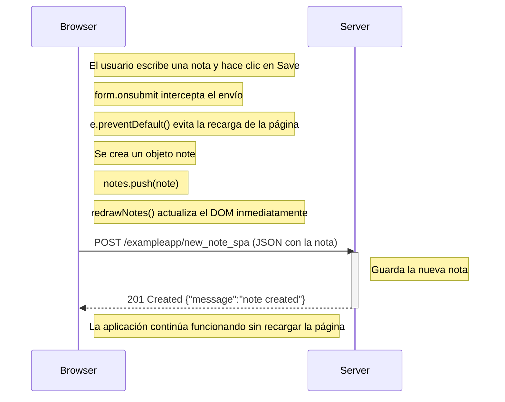

```mermaid
sequenceDiagram
    participant Browser
    participant Server

    Note right of Browser: El usuario escribe una nota y hace clic en Save

    Note right of Browser: form.onsubmit intercepta el envío
    Note right of Browser: e.preventDefault() evita la recarga de la página

    Note right of Browser: Se crea un objeto note
    Note right of Browser: notes.push(note)
    Note right of Browser: redrawNotes() actualiza el DOM inmediatamente

    Browser->>Server: POST /exampleapp/new_note_spa (JSON con la nota)
    activate Server

    Note right of Server: Guarda la nueva nota

    Server-->>Browser: 201 Created {"message":"note created"}
    deactivate Server

    Note right of Browser: La aplicación continúa funcionando sin recargar la página
```